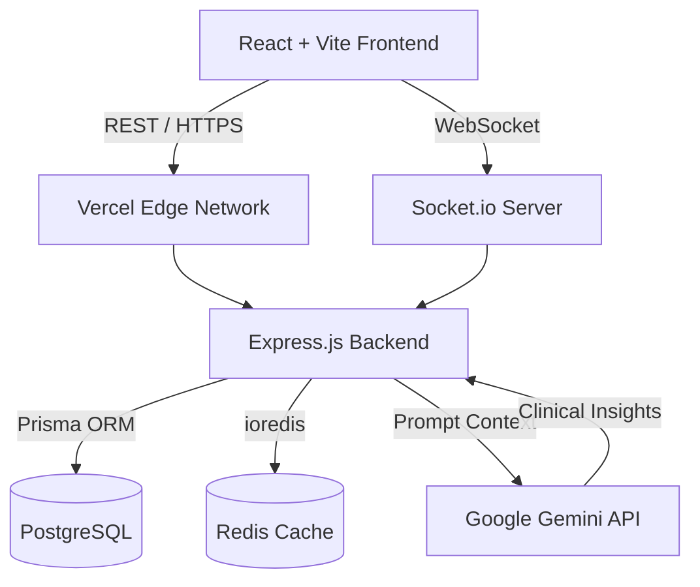

<div align="center">
  
  
  <h1>Swasthify 2.0</h1>
  
  <p>
    <strong>A decentralized, multi-hospital patient health record network powered by AI.</strong>
  </p>

  <p>
    <a href="#features">Features</a> •
    <a href="#architecture">Architecture</a> •
    <a href="#tech-stack">Tech Stack</a> •
    <a href="#getting-started">Getting Started</a> •
    <a href="#ai-integration">AI Integration</a>
  </p>
</div>

---

## 🌟 Overview

**Swasthify** is a multi-tenant healthcare platform that solves the problem of fragmented medical histories. By treating each hospital as a tenant on a unified network, Swasthify ensures that a patient's medical records, vitals, and appointment history follow them wherever they go.

Equipped with a highly resilient backend and a clinical decision support AI powered by Google's Gemini, Swasthify surfaces critical insights for healthcare professionals instantly, drastically reducing diagnosis times and preventing clinical oversights.

---

## ✨ Features

- **🏢 Multi-Tenant Architecture:** Secure isolation of staff across different hospital nodes, while sharing a unified patient registry.
- **🔐 Role-Based Access Control (RBAC):** Strict permissions for Doctors, Nurses, Hospital Admins, and Patients.
- **🧠 AI Clinical Decision Support:** Integration with `gemini-2.5-flash` to analyze vitals trends and cross-reference complete medical histories for predictive clinical insights.
- **📊 Real-time Data Visualization:** Interactive dashboards powered by Recharts for tracking patient vitals (SpO2, BP, Heart Rate) over time.
- **🔄 Resilient Authentication:** Robust JWT-based authentication flow with short-lived access tokens and Redis-backed refresh tokens designed to survive cross-origin deployment boundaries.
- **📄 Automated Reporting:** On-the-fly PDF generation for patient prescriptions and lab reports using `pdfkit`.
- **⚡ Real-time Notifications:** WebSocket integration via `socket.io` for immediate alert delivery to medical staff.

---

## 🏗️ Architecture



### Data Flow Highlights:

- **Aggressive Caching:** Expensive AI computations are aggressively cached in Redis (`AI_CACHE_TTL`), utilizing composite keys tied to the latest database mutation timestamps to ensure data freshness.
- **Timeout Safety:** AI endpoints are wrapped in `Promise.race` blocks to handle upstream cold-start latencies seamlessly without leaving the client hanging.

---

## 💻 Tech Stack

### Frontend (Vercel)

- **Framework:** React 18 + Vite
- **Styling:** Tailwind CSS + Framer Motion
- **State Management:** Zustand
- **Form Handling:** React Hook Form + Zod validation
- **Data Visualization:** Recharts
- **Icons:** Lucide React

### Backend (Render)

- **Runtime:** Node.js + Express.js
- **Database:** PostgreSQL with Prisma ORM
- **Cache & Session:** Redis (`ioredis`)
- **AI Integration:** `@google/generative-ai` (Gemini 2.5 Flash)
- **Security:** `bcryptjs`, `jsonwebtoken`, `express-rate-limit`, `cors`
- **Document Gen:** `pdfkit`

---

## 🚀 Getting Started

### Prerequisites

- [Node.js](https://nodejs.org/en/) (v18+)
- [PostgreSQL](https://www.postgresql.org/)
- [Redis](https://redis.io/)
- Google Gemini API Key

### 1. Clone the repository

```bash
git clone https://github.com/your-username/Swasthify.git
cd Swasthify
```

### 2. Backend Setup

```bash
cd healthcare-backend

# Install dependencies
npm install

# Environment setup
cp .env.example .env
# Edit .env with your local PostgreSQL, Redis credentials, and Gemini API key

# Run migrations
npm run db:migrate

# Start the development server
npm run dev
```

### 3. Frontend Setup

```bash
cd ../healthcare-frontend

# Install dependencies
npm install

# Environment setup
cp .env.local .env
# Ensure VITE_API_URL points to your backend (default: http://localhost:5000)

# Start the Vite development server
npm run dev
```

---

## 🧠 AI Integration Deep Dive

The platform integrates **Google's Gemini 2.5 Flash** model strictly as a **Clinical Decision Support System (CDSS)**.

### Data Privacy

- **Zero PII Exposure:** Patient names, IDs, and hospital correlations are systematically stripped before payloads hit the Google network. Only raw clinical data (vitals, age, gender, medical history types) is transmitted.

### System Prompts

The AI is boxed in by rigid system instructions to prevent hallucinations:

1. Must respond with a strict, pre-defined JSON schema.
2. Expressly forbidden from diagnosing; it may only suggest "findings indicate...".
3. Must explicitly note if data is insufficient for safe analysis.

### Performance

To mitigate the cost and latency of LLM calls, we implement an intelligent caching layer in Redis. The cache key acts as an ETag based on the most recent `recordedAt` timestamp for a given patient. If no new vitals are recorded, the AI response is served from RAM in `~5ms`.

---

## 🔒 Security Posture

- **Cross-Origin Integrity:** Configured strict CORS policies handling cookies correctly between Render (backend) and Vercel (frontend).
- **Rate Limiting:** Active DDoS mitigation on sensitive routes (auth, AI endpoints).
- **Input Validation:** Zod schemas on the frontend and `express-validator` pipelines on the backend ensure sanitary data ingestion.

---

<div align="center">
  <p>Built with ❤️ for the future of healthcare.</p>
</div>
